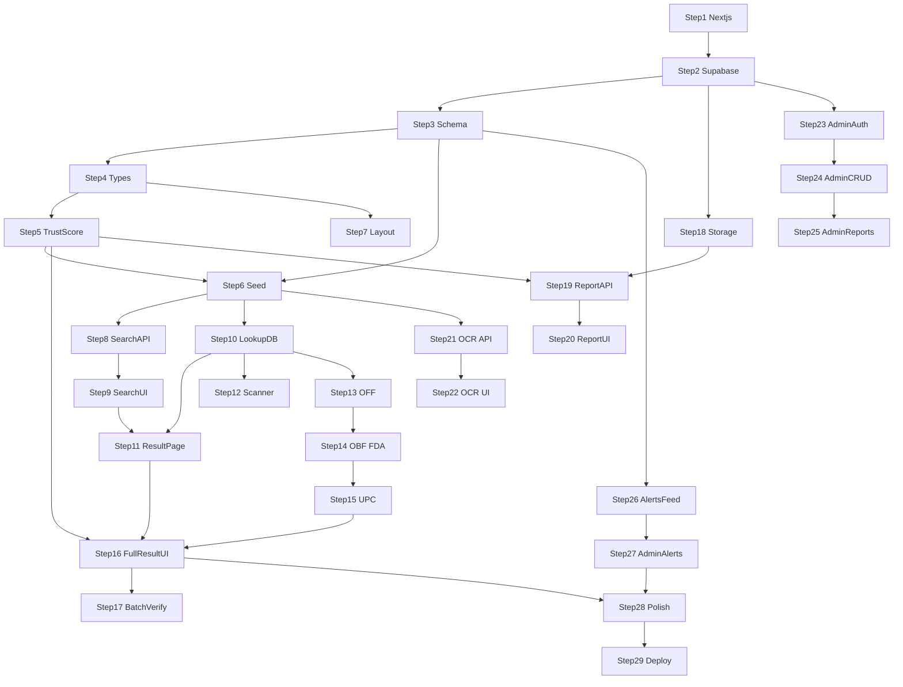

# MarkSure LifeScan — Implementation Plan

**Tagline:** Scan. Verify. Stay Safe.

**Full spec:** [MarkSure_LifeScan_Final_Spec.md](./MarkSure_LifeScan_Final_Spec.md) (identical to [MarkSure_LifeScan_PRD_and_Technical_Spec.md](./MarkSure_LifeScan_PRD_and_Technical_Spec.md))

---

## How to use this document

1. **Complete steps in order** — each step builds on the previous one.
2. **Do not skip ahead** unless a step is explicitly marked optional.
3. **Verify after every step** — run `npm run dev` and follow the "How to verify" note before moving on.
4. **Track your progress** — update the [Master Context](#master-context-paste-at-start-of-every-new-chat) block at the bottom when starting a new chat session.

**Pacing:** 29 steps × ~1–3 hours each ≈ 7 days at ~4 steps/day (solo, hackathon deadline).

---

## Suggested 7-day pacing

| Day | Steps | Focus |
|-----|-------|-------|
| 1 | 1–4 | Scaffold, Supabase, schema, types |
| 2 | 5–9 | Trust engine, seed data, search E2E |
| 3 | 10–13 | Lookup API, result page, scanner, Open Food Facts |
| 4 | 14–17 | External APIs, full result UI, batch verify |
| 5 | 18–22 | Reports, trust recalc, OCR identify |
| 6 | 23–27 | Admin auth, CRUD, alerts |
| 7 | 28–29 | Polish, README, deploy |

---

## Dependency flow



---

## Steps

### Step 1 — Scaffold Next.js App

**PRD:** §10 System Architecture, §13 Build Timeline (Days 1–2)

**Files created/modified:**
- `package.json`
- `app/layout.tsx`
- `app/page.tsx`
- `app/globals.css`
- `tailwind.config.ts`
- `tsconfig.json`
- `next.config.ts`

**What it accomplishes:** Create a fresh Next.js 14+ project with App Router, TypeScript, Tailwind CSS, and ESLint. Replace the default homepage with a minimal placeholder: project name + tagline ("Scan. Verify. Stay Safe.").

**How to verify:** Run `npm run dev` → `http://localhost:3000` shows the MarkSure placeholder page with no console errors.

---

### Step 2 — Supabase Project & Environment Config

**PRD:** §10 Database & Storage, §15 Environment Variables

**Files created/modified:**
- `.env.local`
- `.env.example`
- `lib/supabase/client.ts`
- `lib/supabase/server.ts`

**What it accomplishes:** Create a Supabase project. Add env vars (`NEXT_PUBLIC_SUPABASE_URL`, `NEXT_PUBLIC_SUPABASE_ANON_KEY`, `SUPABASE_SERVICE_ROLE_KEY`). Install `@supabase/supabase-js` and `@supabase/ssr`. Create browser and server Supabase clients.

**How to verify:** Add a temporary `app/api/health/route.ts` that returns `{ supabase: "ok" }` if env vars are set. Hit `/api/health` in the browser.

---

### Step 3 — Database Schema Migration

**PRD:** §9 Database Schema

**Files created/modified:**
- `supabase/migrations/001_initial_schema.sql` (or run via Supabase SQL Editor and save the file for version control)

**What it accomplishes:** Create Postgres enums and tables: `products`, `reports`, `alerts`, and optionally `trust_score_history`. Add indexes on `products.barcode`, `products.name` (trigram or `ilike` index), and FK constraints. Include `source` enum on products (`marksure`, `open_food_facts`, `open_beauty_facts`, `openfda`, `upc_lookup`).

**How to verify:** Supabase Table Editor shows all tables with correct columns. A test `SELECT` from each table succeeds.

---

### Step 4 — TypeScript Types & Shared Constants

**PRD:** §9 Database Schema, §7.1 Status Categories

**Files created/modified:**
- `lib/types/database.ts`
- `lib/types/product.ts`
- `lib/constants/statuses.ts`
- `lib/constants/categories.ts`

**What it accomplishes:** Define TypeScript types/interfaces mirroring DB enums (`ProductStatus`, `ProductCategory`, `AlertType`, `ReportStatus`, etc.) and shared label/color maps for verdict UI.

**How to verify:** `npm run build` passes with no type errors. Import types in a dummy file to confirm they resolve.

---

### Step 5 — Trust Score Engine (Pure Logic)

**PRD:** §8 Trust Score System

**Files created/modified:**
- `lib/trust-score/calculate.ts`
- `lib/trust-score/verdict.ts`
- `lib/trust-score/breakdown.ts`

**What it accomplishes:** Implement deterministic score calculation: +40 admin verified, +25 in DB, +10 valid barcode, +15 no reports; −10 per report, −25 invalid batch, −40 unknown baseline. Map score bands to verdicts (Safe / Warning / Dangerous / Unknown). Return a breakdown array of contributing factors with point values.

**How to verify:** Add a temporary dev-only page or Node script with 3–4 fixture products (verified safe, unknown, reported, batch mismatch) and confirm scores/verdicts match §8 tables.

---

### Step 6 — Seed Product Data

**PRD:** §12 MVP Scope (15–25 entries), §9 `products`, §6.8 batch numbers

**Files created/modified:**
- `supabase/seed.sql` or `scripts/seed.ts`
- `package.json` (add `"seed"` script)

**What it accomplishes:** Insert 15–25 realistic products across all three categories and all five statuses. Include barcodes, batch numbers on at least half, varied trust scores, and at least 2–3 with existing pending reports for demo purposes.

**How to verify:** Supabase Table Editor shows seeded rows. `GET /api/search-product?q=<known-name>` (added in Step 8) returns results — or query directly in SQL Editor.

---

### Step 7 — App Shell, Layout & Navigation

**PRD:** §10 Frontend routes

**Files created/modified:**
- `app/layout.tsx`
- `components/layout/Header.tsx`
- `components/layout/Footer.tsx`
- `app/page.tsx`

**What it accomplishes:** Build responsive app shell with nav links: Home, Scan, Report, Alerts, Admin. Apply Tailwind design tokens (primary color, card styles). Landing page shows hero, search input placeholder, and CTAs for Scan / Upload Photo.

**How to verify:** `npm run dev` → all nav links render (stub pages OK). Layout looks correct on mobile and desktop widths.

---

### Step 8 — Name Search API

**PRD:** §10 `GET /api/search-product`, §5 Product name search

**Files created/modified:**
- `app/api/search-product/route.ts`
- `lib/db/products.ts` (`searchProductsByName`)

**What it accomplishes:** Implement `GET /api/search-product?q=` — case-insensitive partial match against `products.name` and optionally `manufacturer`. Return id, name, category, status, trust_score, image_url. Limit to 10 results.

**How to verify:** `curl "http://localhost:3000/api/search-product?q=aspirin"` (or a seeded name) returns JSON array of matches.

---

### Step 9 — Homepage Search UI

**PRD:** §5, §4.1 Guest flows

**Files created/modified:**
- `components/search/ProductSearch.tsx`
- `app/page.tsx`

**What it accomplishes:** Wire search input with debounced fetch to `/api/search-product`. Show dropdown results; clicking a result navigates to `/product/[id]`.

**How to verify:** Type a seeded product name on `/` → results appear → click navigates (404 OK until Step 11).

---

### Step 10 — Lookup API (MarkSure DB Only)

**PRD:** §6.6 Lookup Pipeline step 1, §10 `POST /api/lookup-product`

**Files created/modified:**
- `app/api/lookup-product/route.ts`
- `lib/db/products.ts` (`findByBarcode`, `findByName`)

**What it accomplishes:** Implement `POST /api/lookup-product` accepting `{ barcode?, name?, category? }`. Search MarkSure DB first. On hit, return full product + computed trust score + breakdown + `source: "marksure"`. On miss, return `{ found: false }` (external calls come in Steps 13–15).

**How to verify:** POST a seeded barcode via curl/Postman → full product JSON. POST unknown barcode → `{ found: false }`.

---

### Step 11 — Basic Product Result Page

**PRD:** §11 Result Page (partial), §10 `/product/[id]`

**Files created/modified:**
- `app/product/[id]/page.tsx`
- `lib/db/products.ts` (`getProductById`)
- `components/product/ProductHeader.tsx`

**What it accomplishes:** Server-render product by UUID. Show name, category, manufacturer, status badge, trust score number. Handle 404 for invalid IDs.

**How to verify:** Click search result → product page renders correct seeded data.

---

### Step 12 — Barcode/QR Scanner Page

**PRD:** §5 Barcode/QR scan, §10 `/scan`

**Files created/modified:**
- `app/scan/page.tsx`
- `components/scan/BarcodeScanner.tsx`
- install `html5-qrcode`

**What it accomplishes:** Camera-based scanner using `html5-qrcode` (handles barcodes and QR). On successful scan, POST to `/api/lookup-product`. If found in DB, redirect to `/product/[id]`; if not found yet, redirect to a temporary `/product/lookup?barcode=...` or store barcode in session for Step 13.

**How to verify:** Scan a seeded product barcode (or type barcode manually in dev fallback input) → lands on product page or lookup flow.

---

### Step 13 — Lookup Pipeline: Open Food Facts

**PRD:** §6.1, §6.6 step 2

**Files created/modified:**
- `lib/integrations/open-food-facts.ts`
- update `app/api/lookup-product/route.ts`

**What it accomplishes:** When DB miss + `category=food` + barcode present, call Open Food Facts API with custom `User-Agent` (§15 `OFF_USER_AGENT`). Map response to a normalized external product shape. Set `status: unknown`, apply trust score engine with −40 baseline. Do **not** persist to DB yet (ephemeral external result).

**How to verify:** POST a real food barcode not in seed data (e.g., a common UPC) with `category: "food"` → returns product name/brands from OFF with Unknown verdict.

---

### Step 14 — Lookup Pipeline: Open Beauty Facts & openFDA NDC

**PRD:** §6.2, §6.3, §6.6 steps 2b/2c

**Files created/modified:**
- `lib/integrations/open-beauty-facts.ts`
- `lib/integrations/openfda-ndc.ts`
- update lookup route

**What it accomplishes:** Add cosmetics fallback (Open Beauty Facts, barcode) and medicine fallback (openFDA NDC Directory, brand name search). Same Unknown + trust score pattern. UI source label distinguishes data origin.

**How to verify:** Test one cosmetic barcode and one medicine brand name not in seed → each returns external data with correct source label.

---

### Step 15 — Lookup Pipeline: UPC Fallback & Not-Found State

**PRD:** §6.5, §6.6 step 3

**Files created/modified:**
- `lib/integrations/upc-lookup.ts`
- `app/product/external/page.tsx` or `app/product/lookup/page.tsx`
- update lookup route

**What it accomplishes:** Final fallback for any category when barcode present and all prior sources miss. If still not found, return explicit "No data found" with CTA to report. Build a result page for external/ephemeral products (no UUID) using query params or session state.

**How to verify:** Unknown barcode eventually returns UPC generic info OR clean "No data found" card with Report CTA — never a blank screen.

---

### Step 16 — Full Result Page UI

**PRD:** §11 Result Page (full), §8 verdict bands

**Files created/modified:**
- `components/product/VerdictPanel.tsx`
- `components/product/TrustScoreBar.tsx`
- `components/product/TrustScoreBreakdown.tsx`
- `components/product/SourceIndicator.tsx`
- `components/product/CommunityReports.tsx`
- update `app/product/[id]/page.tsx`

**What it accomplishes:** Build animated trust score bar, color-coded verdict panel, factor breakdown list, source indicator ("Verified in MarkSure database" vs "Data from Open Food Facts — not yet MarkSure-verified"), community reports count/list, and "Report this product" CTA.

**How to verify:** View products in each status band (seed data) → correct colors, verdict text, breakdown factors, and source labels.

---

### Step 17 — Batch Number Verification

**PRD:** §6.8, §8 (−25 invalid batch)

**Files created/modified:**
- `app/api/verify-batch/route.ts`
- `components/product/BatchVerifyForm.tsx`

**What it accomplishes:** On product pages where `batch_number` exists on record, show optional "Verify Batch Number" field. Match → confirmation message, no score change. Mismatch → −25, update status toward `suspected_counterfeit` if combined signals warrant, show explanatory copy. Hide field when product has no batch on record.

**How to verify:** Enter matching batch → success toast. Enter wrong batch → score drops, breakdown shows "Invalid batch number (−25)", warning copy appears.

---

### Step 18 — Supabase Storage Setup

**PRD:** §10 Database & Storage, §5 report image upload

**Files created/modified:**
- Supabase Storage bucket config (dashboard)
- `lib/storage/upload.ts`

**What it accomplishes:** Create a `report-images` storage bucket with appropriate policies (public read or signed URLs). Helper to upload file buffer and return public URL.

**How to verify:** Upload a test image via a temporary script or API stub → URL loads in browser.

---

### Step 19 — Submit Report API

**PRD:** §10 `POST /api/submit-report`, §8 recalculation trigger

**Files created/modified:**
- `app/api/submit-report/route.ts`
- `lib/db/reports.ts`
- `lib/trust-score/recalculate.ts`

**What it accomplishes:** Accept `{ product_id?, description, image?, anonymous }`. Store report with `status: pending`. If `product_id` provided, recalculate trust score (−10 per report), update product row, optionally insert `trust_score_history` row.

**How to verify:** POST report for a seeded product → row in `reports` table; product `trust_score` decreased by 10.

---

### Step 20 — Report Submission UI

**PRD:** §10 `/report`, §4.1, §5 report image

**Files created/modified:**
- `app/report/page.tsx`
- `components/report/ReportForm.tsx`

**What it accomplishes:** Form with product selector (search) OR free-text for unknown products, description textarea, optional image upload, anonymous checkbox. Pre-fill `product_id` when linked from result page CTA. Success confirmation state.

**How to verify:** Submit report from `/report` and from product page CTA → appears in DB; returning to product page shows updated score (live demo moment).

---

### Step 21 — OCR Image Identification API

**PRD:** §6.7 OCR.space

**Files created/modified:**
- `app/api/identify-image/route.ts`
- `lib/integrations/ocr-space.ts`
- `lib/fuzzy-match.ts`

**What it accomplishes:** Accept image (multipart or base64). Send to OCR.space with `OCRSPACE_API_KEY`. Fuzzy-match extracted text against MarkSure DB names/manufacturers. Return ranked "Did you mean..." suggestions with confidence scores.

**How to verify:** Upload a clear product photo (or image with printed product name) → API returns suggestion list.

---

### Step 22 — Image Upload & Camera Snap UI

**PRD:** §5 Image upload + camera snap, §6.7 camera note

**Files created/modified:**
- `components/identify/ImageIdentify.tsx`
- `components/identify/CameraCapture.tsx`
- `app/identify/page.tsx` (or section on homepage)

**What it accomplishes:** File picker upload and `getUserMedia` camera capture (single frame → same `/api/identify-image` endpoint). Show suggestions; user confirms → run normal lookup pipeline for selected product. No match → fallback message per §6.7.

**How to verify:** Upload and camera snap both return suggestions; confirming a match navigates to product result.

---

### Step 23 — Admin Authentication

**PRD:** §4.2 Admin, §10 Supabase Auth, §12 SHOULD HAVE

**Files created/modified:**
- `app/admin/login/page.tsx`
- `middleware.ts`
- `lib/supabase/middleware.ts`
- Supabase Auth user (dashboard)

**What it accomplishes:** Create one admin user in Supabase Auth. Protect `/admin/*` routes via middleware (session check). Login page with email/password. Logout button in admin layout.

**How to verify:** `/admin` redirects unauthenticated users to login. Valid credentials grant access.

---

### Step 24 — Admin Product CRUD

**PRD:** §4.2, §10 `POST/PATCH /api/admin/products`

**Files created/modified:**
- `app/admin/page.tsx`
- `app/admin/products/page.tsx`
- `app/admin/products/new/page.tsx`
- `app/api/admin/products/route.ts`
- `app/api/admin/products/[id]/route.ts`

**What it accomplishes:** List products with search/filter. Add new product form (all §9 fields). Edit existing product. Server routes verify admin session via service role or authenticated user check.

**How to verify:** Add a new product in admin → searchable on homepage. Edit trust-related flags → changes reflect on public product page.

---

### Step 25 — Admin Report Review & Status Management

**PRD:** §4.2, §7.1, §8 recalculation on admin update

**Files created/modified:**
- `app/admin/reports/page.tsx`
- `app/admin/products/[id]/edit/page.tsx` (flags section)

**What it accomplishes:** List pending reports with resolve action. Admin can set: verification status, `verified_by_authority`, `manufacturer_verified`, recalled flag. Each change triggers trust score recalculation.

**How to verify:** Mark product as recalled → public page shows RECALLED status and updated score. Resolve a report → status changes to reviewed.

---

### Step 26 — OpenFDA Recall Cache & Alerts Feed

**PRD:** §6.4, §10 `GET /api/alerts`, §7.2 (optional cross-check)

**Files created/modified:**
- `scripts/cache-openfda-recalls.ts`
- `app/api/alerts/route.ts`
- `app/alerts/page.tsx`
- `components/alerts/AlertCard.tsx`

**What it accomplishes:** Script fetches openFDA Drug Enforcement records and upserts into `alerts` with `source: openfda`. Run at build time or manually before demo. Alerts page merges admin + OpenFDA alerts. Label section **"Recent FDA Recall Reports (Informational)"** per §6.4 framing.

**How to verify:** Run cache script → `alerts` table populated. `/alerts` shows FDA recalls + any admin-created alerts.

---

### Step 27 — Admin Alert Management

**PRD:** §4.2, §9 `alerts` table

**Files created/modified:**
- `app/admin/alerts/page.tsx`
- `app/api/admin/alerts/route.ts`

**What it accomplishes:** Admin can create manual alerts (recall / counterfeit_warning / general) linked to a product or standalone. Delete/edit admin-origin alerts.

**How to verify:** Create admin alert → appears on `/alerts` immediately alongside OpenFDA entries.

---

### Step 28 — Authenticity Guides, Expiry Content & UI Polish

**PRD:** §11 items 5–6, §13 Day 14

**Files created/modified:**
- `lib/content/authenticity-guides.ts`
- `lib/content/expiry-guides.ts`
- `components/product/AuthenticityGuide.tsx`
- `components/product/ExpiryIndicators.tsx`
- global loading/error states

**What it accomplishes:** Add static per-category authenticity and expiry educational content on result pages. Polish responsive layout, empty states, toast notifications, and consistent spacing/typography across all pages.

**How to verify:** Full user journey on mobile: search → result (guides visible) → report → alerts. No layout breaks.

---

### Step 29 — README, Deployment & Production Smoke Test

**PRD:** §10 Deployment, §14 Pitch Summary, §15 Env vars, §6.4 demo framing

**Files created/modified:**
- `README.md`
- Vercel project config
- `.env.example` (final)

**What it accomplishes:** Write README with setup instructions, env var list, API source attributions, trust score explanation, and hackathon pitch (§14). Deploy to Vercel; set all env vars. Run end-to-end smoke test on production URL.

**How to verify:** Production URL loads; search, scan (manual barcode entry OK), report, alerts, and admin login all work. README instructions allow a fresh clone + setup.

---

## Master Context (paste at start of every new chat)

```
**Project:** MarkSure LifeScan — product verification & safety intelligence platform
**Tagline:** Scan. Verify. Stay Safe.
**Spec:** MarkSure_LifeScan_Final_Spec.md (full PRD + technical spec)

**What it does:** Users verify medicines, cosmetics, or food by name search, barcode/QR scan, or photo (OCR). Lookup order: MarkSure DB → Open Food Facts / Open Beauty Facts / openFDA NDC → UPC fallback. All results run through a rule-based Trust Score Engine (0–100) → Safe / Warning / Dangerous / Unknown. Community reports and admin actions recalculate scores live.

**Tech stack:** Next.js 14+ (App Router) + Tailwind CSS + Supabase (Postgres, Storage, Auth) + Vercel deploy
**Key libs:** html5-qrcode (scan), OCR.space (image ID), fuzzy string match
**External APIs:** Open Food Facts, Open Beauty Facts, openFDA NDC + Enforcement (cached), UPC lookup, OCR.space

**Routes:** / (search), /scan, /product/[id], /report, /alerts, /admin
**Core APIs:** lookup-product, identify-image, verify-batch, search-product, submit-report, alerts, admin/*

**Current step:** Step 1 — Scaffold Next.js App
**Completed:** None yet
**Next up:** Step 1 — Scaffold Next.js App
**Blockers:** None

**Env vars needed:** NEXT_PUBLIC_SUPABASE_URL, NEXT_PUBLIC_SUPABASE_ANON_KEY, SUPABASE_SERVICE_ROLE_KEY, OFF_USER_AGENT, OCRSPACE_API_KEY, UPC_LOOKUP_API_KEY (optional)
```
